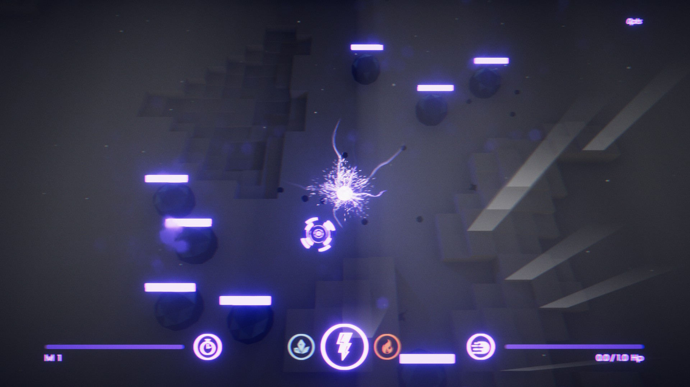
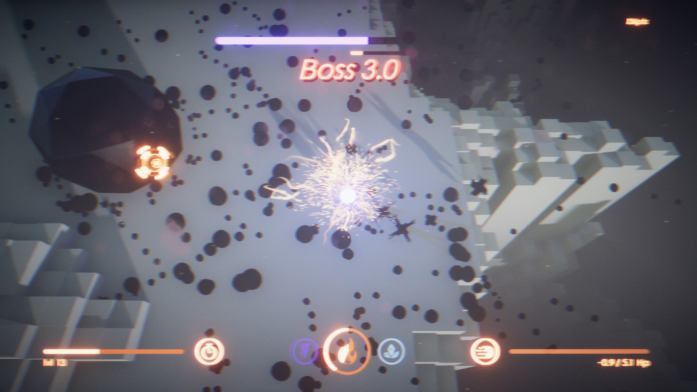
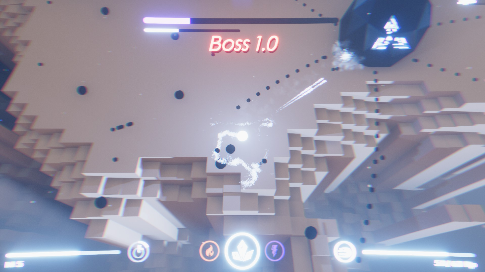
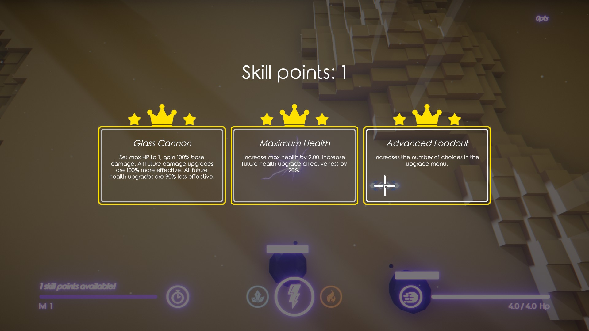
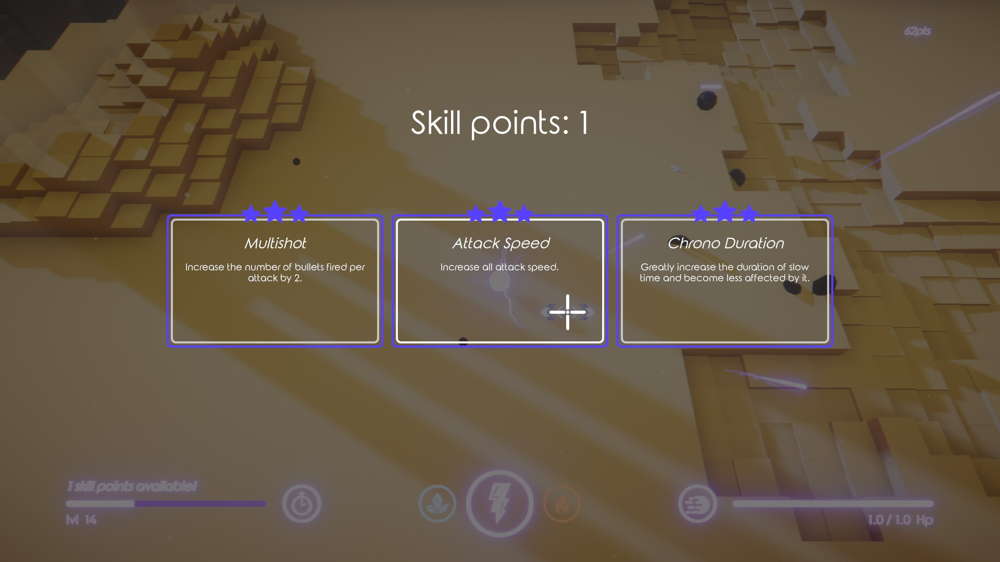
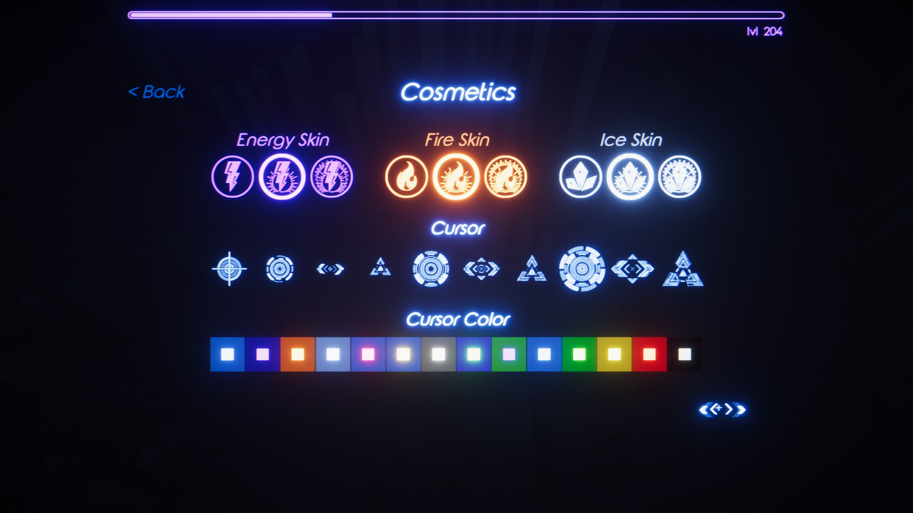
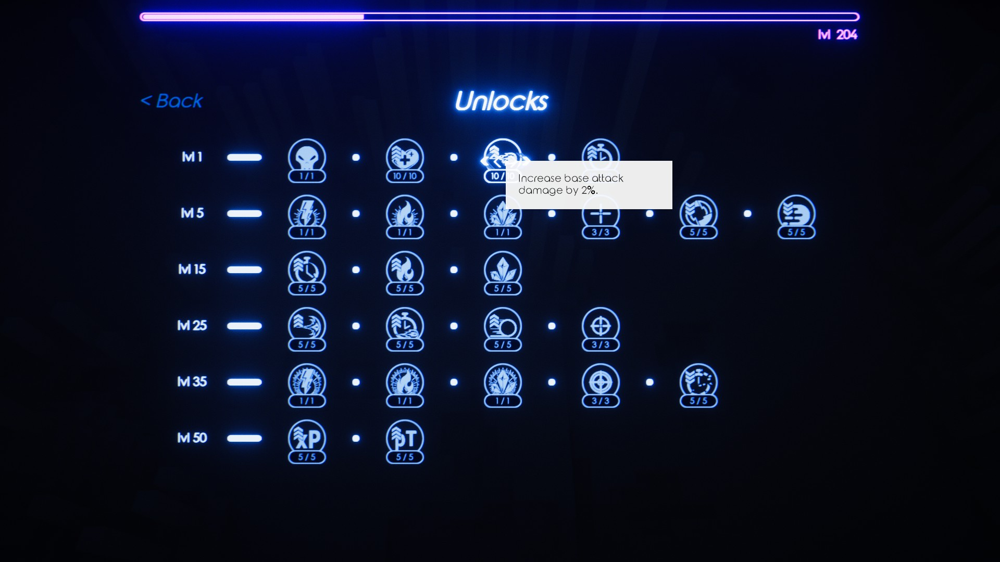

---
hide:
  - navigation
  - toc
  - footer
---

  

  <section class="element-x-hero">
    
ELEMENT X

    

    <h1>Roguelike Bullet Hell</h1>
  </section>

  <section class="element-x-section element-x-embed-panel">
    <iframe src="https://store.steampowered.com/widget/1361120/ " frameborder="0" width="646" height="190" title="Element X Steam Widget" allowtransparency="true" style="color-scheme: light"></iframe>
  </section>

  <section class="element-x-section element-x-video-panel">
    <iframe width="1316" height="740" src="https://www.youtube.com/embed/P7ZU3IZtmg0" title="Element X Trailer" frameborder="0" allow="accelerometer; autoplay; clipboard-write; encrypted-media; gyroscope; picture-in-picture; web-share" referrerpolicy="strict-origin-when-cross-origin" allowfullscreen></iframe>
  </section>

  <section class="element-x-panel">
    <h2>Abilities</h2>
    

      <article class="element-x-item">
        
        
Slow Time

      </article>

      <article class="element-x-item">
        

          
          
          
        

        
Control Elements

      </article>

      <article class="element-x-item">
        
        
Teleport

      </article>
    

  </section>

  <section class="element-x-panel">
    <h2>Features</h2>
    

      <article class="element-x-item">
        
        
Arcade style competitive scoring; global, friends, and personal leaderboards.

      </article>

      <article class="element-x-item">
        
        
Procedurally generated maps, bosses, and attack patterns in every playthrough.

      </article>

      <article class="element-x-item">
        
        
100+ different upgrades and 20+ unlockable perks to craft your own play style.

      </article>

      <article class="element-x-item">
        
        
Variety of UI and player cosmetics.

      </article>
    

  </section>

  <section class="element-x-section element-x-carousel" aria-label="Element X screenshots">
    

      <figure class="element-x-carousel-slide"></figure>
      <figure class="element-x-carousel-slide"></figure>
      <figure class="element-x-carousel-slide"></figure>
      <figure class="element-x-carousel-slide"></figure>
      <figure class="element-x-carousel-slide"></figure>
      <figure class="element-x-carousel-slide"></figure>
      <figure class="element-x-carousel-slide"></figure>
    

    

      <button class="element-x-carousel-btn prev" type="button" aria-label="Previous screenshot">&#10094;</button>
      <button class="element-x-carousel-btn next" type="button" aria-label="Next screenshot">&#10095;</button>
    

  </section>

